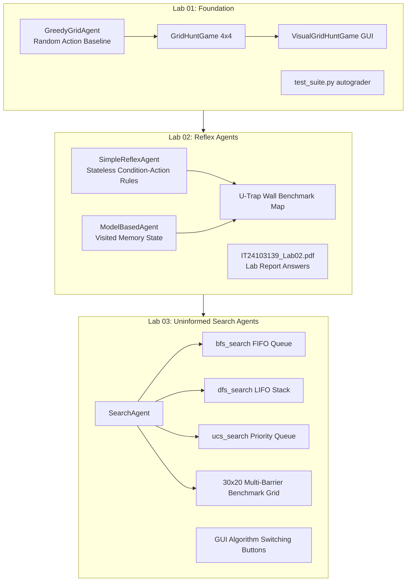

# Comprehensive Analysis Report: IT3012 Practical Base Codebase (Lab 01 – Lab 03)

**Course**: IT3012 – Intelligent Agents  
**Repository**: `IT3012---Practical-Base`  
**Branches Analyzed**: `origin/Lab-01`, `origin/Lab-02`, `origin/Lab_03`  
**Date**: September 3, 2026  

---

## 1. Executive Summary

This report presents a thorough structural and functional analysis of the codebase across the **Lab 01**, **Lab 02**, and **Lab 03** git branches.

The codebase implements a **Pacman-style Grid Hunt Simulation Environment** designed to teach intelligent agent concepts incrementally:
1. **Lab 01 (Foundation)**: Core environment mechanics, simple random/greedy agent baseline, basic Tkinter visualization, and autograder unit testing infrastructure.
2. **Lab 02 (Reflex Agents)**: Condition-action agents (**Simple Reflex Agent**) vs. stateful agents (**Model-Based Agent** with memory to break loops in U-shaped wall traps), accompanied by the written report submission file (`IT24103139_Lab02.pdf`).
3. **Lab 03 (Uninformed Search / Goal-Based Agents)**: Offline planning agents (**SearchAgent**) implementing **Breadth-First Search (BFS)**, **Depth-First Search (DFS)**, and **Uniform-Cost Search (UCS)** pathfinding algorithms with interactive GUI selectors and multi-barrier grid benchmarks.

---

## 2. File Inventory Across Branches

The table below summarizes the contents and presence of files across `Lab-01`, `Lab-02`, and `Lab_03`:

| File Name | Lab 01 | Lab 02 | Lab 03 | Primary Role / Description |
| :--- | :---: | :---: | :---: | :--- |
| [`agent.py`](file:///c:/Users/Dell/Downloads/IA%20lab%2005/IT3012---Practical-Base/agent.py) | 12 lines | 12 lines | 202 lines | Agent implementations (`GreedyGridAgent`, `SearchAgent` with BFS, DFS, UCS). |
| [`grid_game.py`](file:///c:/Users/Dell/Downloads/IA%20lab%2005/IT3012---Practical-Base/grid_game.py) | 55 lines | 55 lines | 55 lines | Core terminal 4x4 grid hunt environment logic and percept generator. |
| [`simulator.py`](file:///c:/Users/Dell/Downloads/IA%20lab%2005/IT3012---Practical-Base/simulator.py) | 19 lines | 22 lines | 22 lines | CLI simulation driver for step-by-step agent execution. |
| [`test_suite.py`](file:///c:/Users/Dell/Downloads/IA%20lab%2005/IT3012---Practical-Base/test_suite.py) | 111 lines | 118 lines | 118 lines | `unittest` autograder test suite for reflex agents and search pathfinding. |
| [`visual_grid_game.py`](file:///c:/Users/Dell/Downloads/IA%20lab%2005/IT3012---Practical-Base/visual_grid_game.py) | 186 lines | 461 lines | 501 lines | Tkinter GUI visualization engine, reflex agents (Lab 2), and multi-algo GUI (Lab 3). |
| `Lab 02 answers/IT24103139_Lab02.pdf` | — | 355 KB PDF | — | Student written submission report for Lab 02 (Student ID: IT24103139). |
| `__pycache__/*` | — | — | PyCache | Python 3.14 compiled bytecode artifacts (`agent`, `grid_game`, `visual_grid_game`). |

---

## 3. Branch-by-Branch Deep Dive

### 3.1. Branch: `Lab-01` (Practical 01 Baseline)

#### Branch Objective
Establish the foundational Pacman-style 2D grid environment, basic agent-environment loop, command-line simulator, Tkinter GUI renderer, and autograder testing setup.

#### Detailed File Analysis

1. **[`agent.py`](file:///c:/Users/Dell/Downloads/IA%20lab%2005/IT3012---Practical-Base/agent.py)**
   - **Classes Defined**: `GreedyGridAgent`
   - **Key Methods**:
     - `__init__()`: Initializes `actions_pool = ['Up', 'Down', 'Left', 'Right']`.
     - `sense_and_act(percept)`: Takes percept dictionary and returns a random direction (`random.choice(self.actions_pool)`).
   - **Functional Role**: Functions as a baseline random/greedy reflex agent with no state or path planning.

2. **[`grid_game.py`](file:///c:/Users/Dell/Downloads/IA%20lab%2005/IT3012---Practical-Base/grid_game.py)**
   - **Classes Defined**: `GridHuntGame`
   - **Key Methods**:
     - `__init__(width=4, height=4)`: Sets up a 4x4 grid. Places agent at `[0, 0]`, hardcoded food at `{(1, 2), (2, 3), (3, 0), (2, 1)}`, and walls at `{(1, 1), (2, 2)}`. Initializes score to `0` and steps to `0`.
     - `get_percept(agent)`: Constructs percept dictionary containing `agent_pos`, `smells_food`, `hit_wall`, `score`, and `remaining_food`.
     - `execute_action(agent, action)`: Updates position based on `Up`, `Down`, `Left`, `Right`. Deducts 5 points for wall collisions (`self.score -= 5`) and awards 20 points for consuming food pellets (`self.score += 20`).
     - `is_done()`: Returns `True` if all food pellets are cleared or steps reach 20.
   - **Functional Role**: Encapsulates terminal environment mechanics, physics rules, collision handling, and reward dynamics.

3. **[`simulator.py`](file:///c:/Users/Dell/Downloads/IA%20lab%2005/IT3012---Practical-Base/simulator.py)**
   - **Functions Defined**: `run_grid_hunt()`
   - **Functional Role**: Command-line simulation runner. Instantiates `GridHuntGame` and `GreedyGridAgent`, running a `while not env.is_done():` loop while logging step-by-step position, remaining food, and current score to console.

4. **[`test_suite.py`](file:///c:/Users/Dell/Downloads/IA%20lab%2005/IT3012---Practical-Base/test_suite.py)**
   - **Classes Defined**: `TestPractical1And2_ReflexAgents`, `TestPractical3_SearchAgent`
   - **Key Test Methods**:
     - `test_simple_reflex_logic()`: Asserts agent responds to `food_here` and `wall_ahead` percepts.
     - `test_model_based_memory()`: Tests if model-based agents avoid repeating actions when facing identical consecutive percepts.
     - `test_bfs_shortest_path()`: Validates that BFS finds the optimal 6-step path around a U-shaped wall trap.
     - `test_bfs_unreachable_goal()`: Ensures BFS returns `None` or `[]` when the goal is boxed in by walls.
   - **Functional Role**: Automated testing harness using Python’s `unittest` framework to grade student lab implementations.

5. **[`visual_grid_game.py`](file:///c:/Users/Dell/Downloads/IA%20lab%2005/IT3012---Practical-Base/visual_grid_game.py)**
   - **Classes Defined**: `VisualGridHuntGame`, `GridGameGUI`
   - **Functional Role**: Tkinter graphical user interface. Renders grid cells, wall blocks (grey), food pellets (gold circles), and agent position (yellow circle with direction indicator). Features dynamic step animation scheduled via `root.after(250, step)`.

---

### 3.2. Branch: `Lab-02` (Practical 02 – Reflex & Model-Based Agents)

#### Branch Objective
Introduce reflexive agent architectures: comparing a **Simple Reflex Agent** (pure condition-action rules) against a **Model-Based Agent** (maintains internal state/memory of visited locations to escape infinite loops in local traps like U-shaped walls).

#### Detailed File Analysis

1. **`Lab 02 answers/IT24103139_Lab02.pdf`**
   - **File Type**: Binary PDF document (355 KB)
   - **Functional Role**: Official lab submission report for student `IT24103139`. Contains written answers, theoretical analysis, condition-action table explanations, and comparison charts between Simple Reflex and Model-Based agents.

2. **[`visual_grid_game.py`](file:///c:/Users/Dell/Downloads/IA%20lab%2005/IT3012---Practical-Base/visual_grid_game.py)** (Expanded from 186 lines to 461 lines)
   - **New Classes Introduced**:
     - `SimpleReflexAgent`:
       - `sense_and_act(percept)`: Implements condition-action rules. Checks immediate sensors (`food_here`, `wall_ahead`, `wall_left`, `wall_right`). Turns or moves forward based on local immediate percepts without storing any past history.
     - `ModelBasedAgent`:
       - `__init__()`: Maintains state variables `self.visited = set()`, `self.turn_count = 0`.
       - `_cell_in_direction(direction)`: Helper function calculating projected target grid coordinates based on facing orientation (`Up`, `Down`, `Left`, `Right`).
       - `sense_and_act(percept)`: Updates internal map of visited coordinates. If moving forward leads into a previously visited cell or a wall, overrides standard reflex action and turns to explore unvisited territory.
     - `GridGameGUI`:
       - Configured with a dedicated **U-shaped Wall Trap benchmark map**:
         ```python
         u_trap_walls = [
             (4, 2), (4, 3), (4, 4), (4, 5),  # Left arm
             (5, 2),                          # Bottom base
             (6, 2), (6, 3), (6, 4), (6, 5)   # Right arm
         ]
         ```
       - Allows visual side-by-side performance evaluation: demonstrates how `SimpleReflexAgent` gets stuck bouncing inside the U-trap indefinitely, whereas `ModelBasedAgent` uses memory to turn around and escape.

3. **[`agent.py`](file:///c:/Users/Dell/Downloads/IA%20lab%2005/IT3012---Practical-Base/agent.py)**, **[`grid_game.py`](file:///c:/Users/Dell/Downloads/IA%20lab%2005/IT3012---Practical-Base/grid_game.py)**, **[`simulator.py`](file:///c:/Users/Dell/Downloads/IA%20lab%2005/IT3012---Practical-Base/simulator.py)**, **[`test_suite.py`](file:///c:/Users/Dell/Downloads/IA%20lab%2005/IT3012---Practical-Base/test_suite.py)**
   - Retained from Lab 01 with minor comment/formatting refinements.

---

### 3.3. Branch: `Lab_03` (Practical 03 – Uninformed Search Algorithms)

#### Branch Objective
Implement offline goal-based search planning in `SearchAgent` using **Breadth-First Search (BFS)**, **Depth-First Search (DFS)**, and **Uniform-Cost Search (UCS)**. Provide interactive GUI algorithm switching and test search efficiency across complex obstacle layouts.

#### Detailed File Analysis

1. **[`agent.py`](file:///c:/Users/Dell/Downloads/IA%20lab%2005/IT3012---Practical-Base/agent.py)** (Expanded from 12 lines to 202 lines)
   - **New Classes Introduced**: `SearchAgent`
   - **Key Methods**:
     - `__init__()`: Initializes `self.active_algo = 'BFS'`, `self.plan = []`, and direction vectors `self.actions_pool`.
     - `bfs_search(start, goal, walls, grid_size)`:
       - Uses `collections.deque` for FIFO queue operations.
       - Explores nodes level-by-level to guarantee the **shortest path in step count**.
       - Returns a list of actions (`['move_forward', 'turn_left', ...]`) from `start` to `goal`.
     - `dfs_search(start, goal, walls, grid_size)`:
       - Uses a Python list as a LIFO stack.
       - Explores deep branches first. Non-optimal path length, but useful for deep space exploration.
     - `ucs_search(start, goal, walls, grid_size)`:
       - Uses `heapq` priority queue tracking path cost `g(n)`.
       - Expands nodes with lowest cumulative cost first.
     - `sense_and_act(percept)`:
       - **Goal Selection**: Identifies nearest food pellet using Manhattan Distance:
         $$\text{Distance} = |x_{\text{food}} - x_{\text{agent}}| + |y_{\text{food}} - y_{\text{agent}}|$$
       - **Plan Execution**: If `self.plan` is empty, invokes the active search algorithm (`BFS`, `DFS`, or `UCS`), stores the returned sequence in `self.plan`, and pops actions tick-by-tick (`return self.plan.pop(0)`).

2. **[`visual_grid_game.py`](file:///c:/Users/Dell/Downloads/IA%20lab%2005/IT3012---Practical-Base/visual_grid_game.py)** (Expanded from 461 lines to 501 lines)
   - **GUI Algorithm Control Buttons**: Added `make_bfs()`, `make_dfs()`, and `make_ucs()` callback handlers attached to Tkinter buttons (`BFS Search`, `DFS Search`, `UCS Search`).
   - **Complex Benchmark Grid**: Configured with a 30x20 grid, 10 food items, and 15 custom fixed wall barriers:
     - **Vertical Barrier**: `(5,4)` to `(5,8)`
     - **Horizontal Barrier**: `(12,12)` to `(16,12)`
     - **L-Shaped Barrier**: `(22,6)` to `(24,8)`
   - Enables real-time visual comparison of path efficiency, node expansions, step counts, and food collection strategies between BFS, DFS, and UCS.

3. **`__pycache__/` Directory**
   - Python bytecode cache files generated when running `agent.py`, `grid_game.py`, and `visual_grid_game.py` under Python 3.14.

---

## 4. Architectural & Algorithmic Evolution



---

## 5. Comparative Analysis Matrix

| Feature / Aspect | Lab 01 | Lab 02 | Lab 03 |
| :--- | :--- | :--- | :--- |
| **Agent Intelligence** | Pure Random (`GreedyGridAgent`) | Reflex Rules (`SimpleReflexAgent` & `ModelBasedAgent`) | Offline Goal-Based Planning (`SearchAgent`) |
| **Memory / Internal State** | None | Visited set & position tracking (`self.visited`) | Plan action queue (`self.plan`) & Search tree frontier |
| **Pathfinding Algorithms** | None | Reactive local step selection | **BFS**, **DFS**, and **UCS** |
| **Map Complexity** | 4x4 grid (Terminal) / 12x12 grid (GUI) | 10x8 U-shaped trap benchmark | 30x20 Grid with 15 custom multi-barrier walls |
| **GUI Controls** | Start / Step simulation | Agent selection drop-down / comparison | Algorithm Selector Buttons (BFS / DFS / UCS) |
| **Autograder Support** | Basic environment tests | Reflex agent rule & memory tests | Search optimality & unreachable goal tests |
| **Lab Deliverables** | Initial codebase | Code + `IT24103139_Lab02.pdf` report | Full SearchAgent search implementations |

---

## 6. Accessing & Using This Report File

This analysis has been compiled into a standalone, downloadable Markdown file located in your project directory:

- **Local Path**: [`Lab_01_to_03_Analysis_Report.md`](file:///c:/Users/Dell/Downloads/IA%20lab%2005/IT3012---Practical-Base/Lab_01_to_03_Analysis_Report.md)

### How to Convert or Download:
1. **VS Code / IDE Markdown Preview**: Open [`Lab_01_to_03_Analysis_Report.md`](file:///c:/Users/Dell/Downloads/IA%20lab%2005/IT3012---Practical-Base/Lab_01_to_03_Analysis_Report.md) in your IDE and press `Ctrl+K V` to preview.
2. **Export to PDF**: Right-click the markdown preview in VS Code (or use Pandoc/Markdown PDF extension) to export as a formatted PDF.
